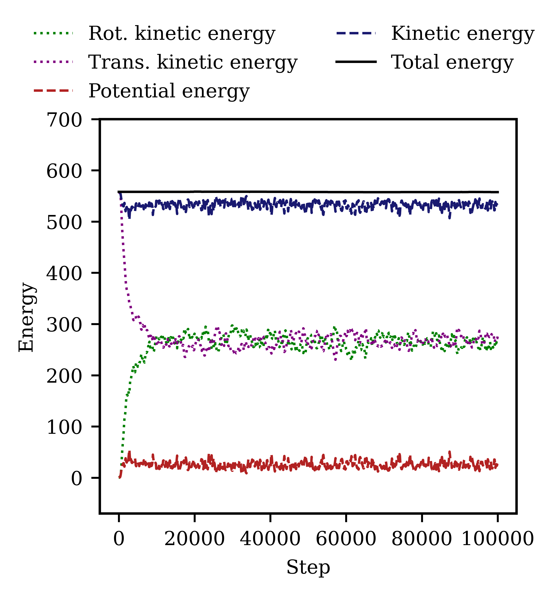
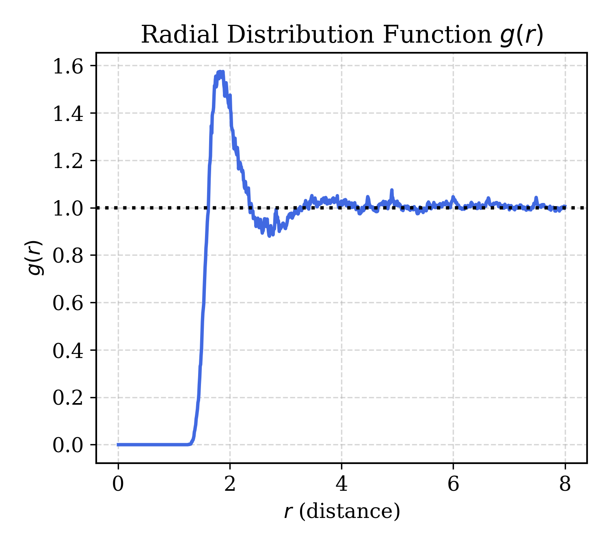
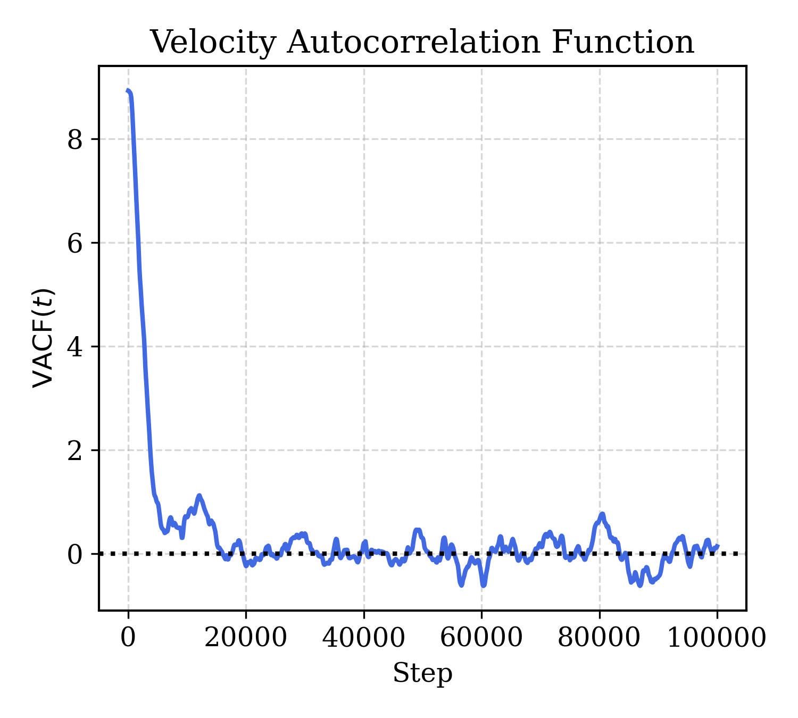

# energy-conserving-contact-dynamics
Energy-Conserving Contact Dynamics of Nonspherical Rigid-Body Particles

This repository provides a modified implementation of the Langston model for simulating body particles in LAMMPS (22 Jul 2025). The modifications are based on the original framework by [Langston et al., 2010](https://link.springer.com/article/10.1007/s10035-010-0217-4), with improvements designed to eliminate discontinuous forces in body particle interactions.

## 🚀 Contribution

This implementation introduces key improvements for handling rigid body interactions in simulations, focusing on **energy conservation** and **interaction prioritization**.

### Energy Conservation via Conservative Forces

To avoid **discontinuous forces**, interactions are modified to ensure smooth contact transitions. Discontinuities are eliminated by refining contact detection logic and prioritizing interactions based on geometric relevance.

### Interaction Priority Hierarchy

Contact interactions follow a hierarchy based on geometric configuration:

- **Edge–Edge case**:
  Edge–Edge > Vertex–Edge > Vertex–Vertex

- **Edge–Face case**:
  Edge–Face (Vertex–Face) > Vertex–Edge > Vertex–Vertex

### Contact Point Evaluation

The contact point is validated to ensure it lies **within the particle skin** but **not directly on an edge or face**, avoiding instability in force computation.

- **Edge–Edge case**:
  Edge–Edge Distance ≤ Vertex–Edge Distance ≤ Vertex–Vertex Distance

- **Edge–Face case**:
  Edge–Face (Vertex–Face) Distance ≤ Vertex–Edge Distance ≤ Vertex–Vertex Distance

These refinements improve the physical fidelity of contact resolution in rigid-body simulations, especially for complex polyhedral interactions.

## Visual Overview

<table>
  <tr>
    <th>Model (125 cubes with density: 0.125)</th>
    <th>Trajectory</th>
    <th>Radial Distribution Function</th>
    <th>Velocity Auto-Correlation</th>
  </tr>
  <tr>
    <td></td>
    <td></td>
    <td></td>
    <td></td>
  </tr>
</table>


## 🔧 Installation

The codes have been tested with [LAMMPS (22 Jul 2025)](https://download.lammps.org/tars/index.html). Compatibility with newer versions is not guaranteed.

#### Steps

1. **Download and extract LAMMPS**  
   Get the source from the [LAMMPS download page](https://download.lammps.org/tars/index.html).

2. **Copy source files**  
   Copy the following files into the `lammps/src/BODY/` directory:
   - `pair_body_rounded_polyhedron.cpp`
   - `pair_body_rounded_polyhedron.h`

3. **Build LAMMPS with the BODY package**  
   Follow the official instructions to:
   - [Build LAMMPS](https://docs.lammps.org/Build.html)
   - [Include the BODY package](https://docs.lammps.org/Build_package.html)

## 🧭 Visualization

The script `~/dump2gsd/dump2gsd.py` can be used to convert a LAMMPS custom dump file into a `.gsd` file, which can be visualized in [OVITO](https://www.ovito.org/).

> **Note:** The dump command in your LAMMPS input script **must match exactly** the following format:

```lammps
compute 10 all property/atom x y z quatw quati quatj quatk
dump mydump all custom 100 dump.quat id c_10[1] c_10[2] c_10[3] c_10[4] c_10[5] c_10[6] c_10[7]
```

## 📈 Plot Energy

To generate energy plots from your LAMMPS simulation:

1. Copy the contents of the `~/Plot_energy` directory into the folder containing your `log.lammps` file.
2. Run the script using:

  ```bash
  bash energy.sh
  ```

## 🧪 Test
A sample system containing 125 cubes is available in the `~/Test` directory.
